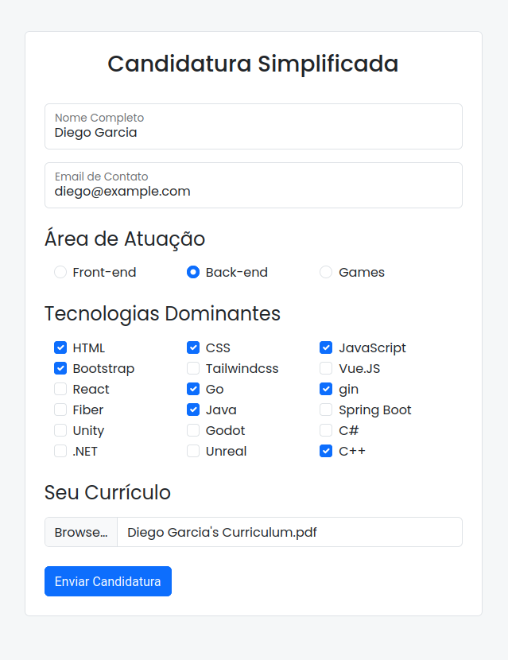

# candidatura-simplificada

Formulário de candidatura desenvolvido para estudo da tecnologia Bootstrap.

## Detalhes Técnicos

O envio do formulário é realizado pelo método POST com corpo em formato `multipart/form-data`.

> obs: atualmente o método está definido para GET porque o Github Pages não aceita POST

Os valores enviados são:

- `name`: nome completo do aplicante;
- `email`: email;
- `area`: área de atuação;
- `technologies`: lista de tecnologias dominantes;
- `curriculum`: currículo em PDF.